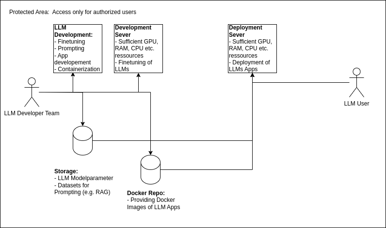

# Concept Large-Language-Model (LLM) Hosting

Outline of a concept to host custom LLM models from Hugging-Face
like LLama or others. 


## Overview



Overview of a concept to build a infrastructure where LLM users have access to different LLM apps. 
E.g. a text classifier or a chatbot. 


- LLM Developer team tasks:
    - App (microservice) development 
        - Finetuning of LLMS if nessessary 
        - Design of Prompts and API (e.g.retrieval-augmented-generation (RAG) in combination with internal datasets)
        - Using techniques to optimize runtime (Quantization, parameter-efficient finetuning (PEFT)) 
    - Containerization of Apps and providing Docker images
    - Testing and validation of Apps
    - Deployment of developed Apps


The following entities have to protected agains un-authorized access.

- **Development Server**:
    -  Has sufficient resources to run and finetune LLMs 
        - Depends on size of selected LLMs:
          For example [LLama 3](https://ai.meta.com/blog/meta-llama-3/) needs sufficient memory on a GPU 

- **Storage**:
    - Stores modelparameters of finetuned LLMs 
    - Stores datasets for prompting (RAG)

- **Docker Repository**:
    - Stores different versions of docker images of the developed apps
    - The LLM developer teams pushes these images to this repository

- **Deployment Server**
    - In order to seperate deployment and development of LLM apps a separate server is suggested:
        - Pull end deploy images of the docker repository 
        - Pull relevant dataset and modelparameters 
    - If optimization techniques like PEFT and quantization lead to valid results then less computational ressources 
      are needed. 


## Examplary Terraform File to set up a virtual machines in Microsoft Azure

It has the following entities:
- Cloud storage (model parameter, datasets) and handling of access 
- Virtual network to allow scaling and handling of different user requests. It also allows secure internal communication.
- GPU (Cuda installation may also be included in this file if needed). The size of the GPU depends on the needs of the LLM. 

Missing tasks:
- Pull and deploy Docker images of the Azure docker registry. E.g. it can be defined that always the latest docker images shall be used. 
- Parameters and variables have to be set according to the actual setting (e.g. access keys, ssh keys, etc.).


```terraform 
# Azure Provider
provider "azurerm" {
  features {}
}

# Resource Group
resource "azurerm_resource_group" "rg" {
  name     = "rg-llm-single-gpu"
  location = "East US"
}

# Storage Account
resource "azurerm_storage_account" "storage" {
  name                     = "llmstorageaccount"
  resource_group_name      = azurerm_resource_group.rg.name
  location                 = azurerm_resource_group.rg.location
  account_tier             = "Standard"
  account_replication_type = "LRS"
}

# Blob-Container
resource "azurerm_storage_container" "blob_container" {
  name                  = "data"
  storage_account_name  = azurerm_storage_account.storage.name
  container_access_type = "private"
}

# Virtual Network
resource "azurerm_virtual_network" "vnet" {
  name                = "vnet-llm-single-gpu"
  address_space       = ["10.0.0.0/16"]
  location            = azurerm_resource_group.rg.location
  resource_group_name = azurerm_resource_group.rg.name
}

# Subnet
resource "azurerm_subnet" "subnet" {
  name                 = "subnet-llm"
  resource_group_name  = azurerm_resource_group.rg.name
  virtual_network_name = azurerm_virtual_network.vnet.name
  address_prefixes     = ["10.0.1.0/24"]
}

# Network Security Group
resource "azurerm_network_security_group" "nsg" {
  name                = "nsg-llm"
  location            = azurerm_resource_group.rg.location
  resource_group_name = azurerm_resource_group.rg.name

  security_rule {
    name                       = "AllowSSH"
    priority                   = 100
    direction                  = "Inbound"
    access                     = "Allow"
    protocol                   = "Tcp"
    source_port_range          = "*"
    destination_port_range     = "22"
    source_address_prefix      = "*"
    destination_address_prefix = "*"
  }
}

# Network Interface
resource "azurerm_network_interface" "nic" {
  name                = "nic-llm-single-gpu"
  location            = azurerm_resource_group.rg.location
  resource_group_name = azurerm_resource_group.rg.name

  ip_configuration {
    name                          = "ipconfig"
    subnet_id                     = azurerm_subnet.subnet.id
    private_ip_address_allocation = "Dynamic"
  }
}

# GPU Virtual Machine
resource "azurerm_linux_virtual_machine" "vm" {
  name                = "vm-llm-single-gpu"
  location            = azurerm_resource_group.rg.location
  resource_group_name = azurerm_resource_group.rg.name
  size                = "Standard_NC6s_v3" # 1 GPU
  admin_username      = "adminuser"
  network_interface_ids = [
    azurerm_network_interface.nic.id
  ]
  admin_ssh_key {
    username   = "adminuser"
    public_key = file("~/.ssh/id_rsa.pub")
  }
  os_disk {
    caching              = "ReadWrite"
    storage_account_type = "Standard_LRS"
  }
  source_image_reference {
    publisher = "Canonical"
    offer     = "UbuntuServer"
    sku       = "20_04-lts-gen2"
    version   = "latest"
  }

  # Cloud-Init to include Cloud Storage
  custom_data = <<EOF
#!/bin/bash
# Update and install dependencies
apt-get update
apt-get install -y docker.io curl

# Install Azure CLI
curl -sL https://aka.ms/InstallAzureCLIDeb | sudo bash

# Grant access to blob storage
export AZURE_STORAGE_ACCOUNT=llmstorageaccount
export AZURE_STORAGE_KEY=${var.storage_account_key}
az storage blob download-batch -d /data --source data
EOF
}

# Output of Storage Key
output "storage_account_key" {
  value = azurerm_storage_account.storage.primary_access_key
  sensitive = true
}

```