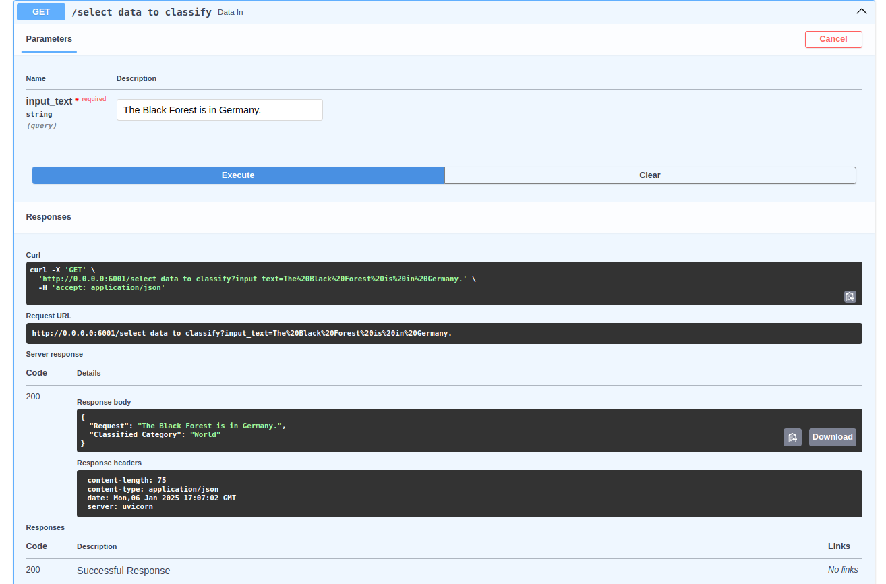

# llm_investigation

This repo investigates how transformer models from hugging face can be used for sequence classification. 
It shows how an application can be build and deployed as a docker container. 
In this example the [ag news](https://huggingface.co/datasets/fancyzhx/ag_news) dataset is used.
For demonstration purpose a relatively small model is used: [destilbert base uncased](https://huggingface.co/distilbert/distilbert-base-uncased)


## Build docker image

```
docker build --no-cache  -t news_classifier_app/v0 . --file dockerfile --platform linux/amd64
```

## Finetune model

1. Run docker
```
docker run  -it -p 6001:6001 news_classifier_app/v0 sh
```
2. Finetune model in the docker container container and get parameters 
```
python3.11 finetune.py
```
3. Run the classifier app
```
python3.11 classifier_app.py
```

The second step will create the finetuned model and save the model parameters and the tokenizer. 
These are then used in the third step to run the actual classifier_app. 
Finetuning is much faster on a GPU device! The dockerfile includes CUDA. Make sure that your
host machine as a CUDA compatible GPU device and that it is installed. 

Alternatively parameter-efficient finetuning can be considered (e.g. LoRA). 
For reference see [here](https://huggingface.co/docs/diffusers/training/lora)

## Run docker image

If the data of the finetuned data and tokenizer are availalbe from an storage (e.g. s3) then these 
can be loaded and the folder can be mounted when the docker image is executed. 
This saves the finetuning time and probably the model can be used on a CPU device.
This can be done using the following command: 
```
docker run  -v path/to/finetuned_model_data:/classifier_app/data -p 6001:6001 news_classifier_app/v0 
```

Then open ```http://0.0.0.0:6001/docs``` in your local browser. 
There, you can type news text which gets classified. 

You should see the following views in your browser:
|  Default view | Response view |
| - | - |
|  | |


## Local usage

For local usage it is recommened to set up a virtual environment.
This can be done with the following steps.
If you don't have virtualenv installed do
```
sudo apt install python3-venv
```

Setup an virtual env with
```
python3 -m venv env
```

Activate the virtual env
```
source env/bin/activate
```

Install requirements using `requirements.txt`

After that finetuing can be done. After that the app can be excecuted in the same way as it is done within the docker container (see above)

## Concept to host llms

A description which infrastructure is need to host llm applications and deploy docker images is described [here](./Concept_Hosting/Concept.md)